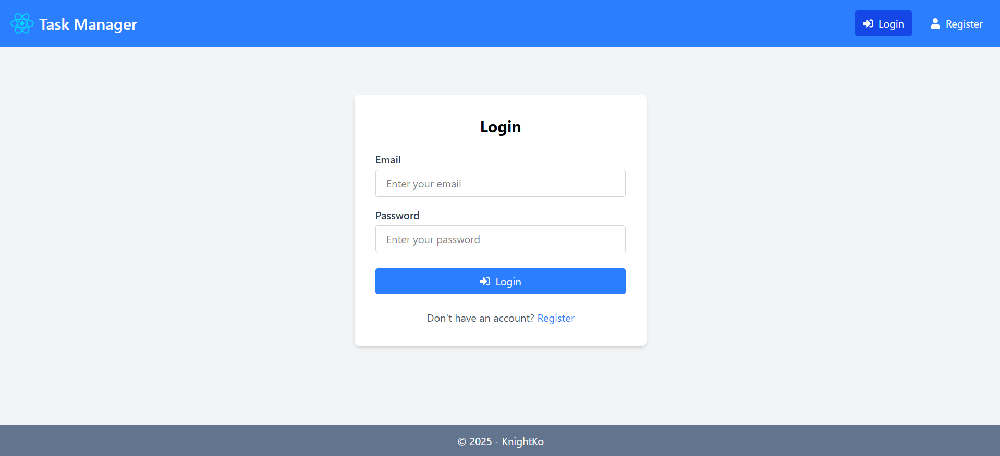
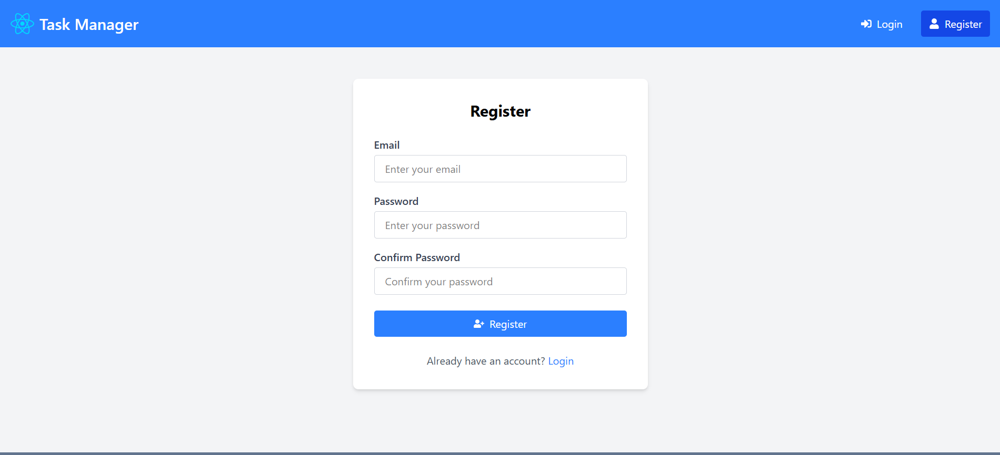
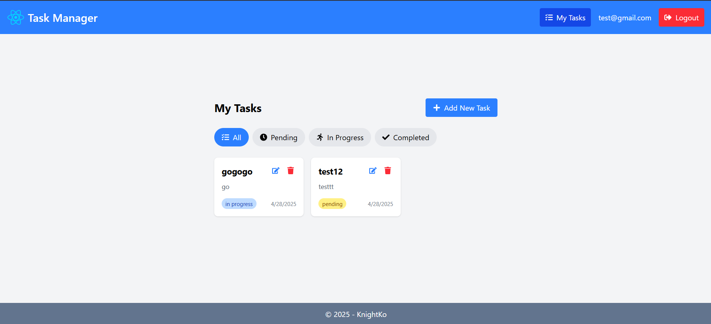

# Task management web app

## เทคโนโลยีที่ใช้

- **Frontend**: Vite.js (React + TypeScript)
- **Backend**: Nest.js
- **Database**: PostgreSQL
- **ORM**: Sequelize
- **Authentication**: Passport.js และ JWT (JSON Web Token)
- **Styling**: Tailwind CSS
- **Icons**: react-icons
- **Notifications**: react-toastify
- **Form Management**: Formik และ Yup
- **Testing**: Vitest

ในการใช้งาน สามารถพิม

```bash
docker-compose up -d --build
```

เพื่อรัน PostgreSQL ได้

ในการรัน backend โดย

```bash
cd backend
npm install
npm run start:dev
```

ในการรัน frontend โดย

```bash
cd frontend
npm install
npm run dev
```

ใน backend มี module แยกตามหน้าที่ auth , tasks , users
ใช้ Sequelize เป็น ORM

ในการ Authentication ใช้ Passport.js ในการจัดการ authentication strategies
และใช้ JWT (JSON Web Token) สำหรับการตรวจสอบตัวตน

frontend ใช้ library เสริมในการใช้ icons โดยใช้ react-icons และใช้ toastify ในการจัดการ toast
และใช้ tailwind css ในการตกแต่ง style
ใช้ Formik และ Yup ในการจัดการและตรวจสอบ form

ใช้ vitest ในการ test 3 component

รูปตัวอย่างของเว็บไซต์

หน้า login


หน้า register


หน้า จัดการ task

